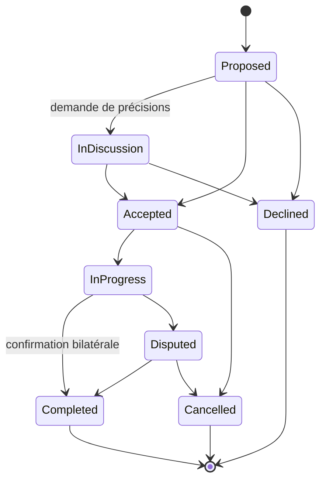
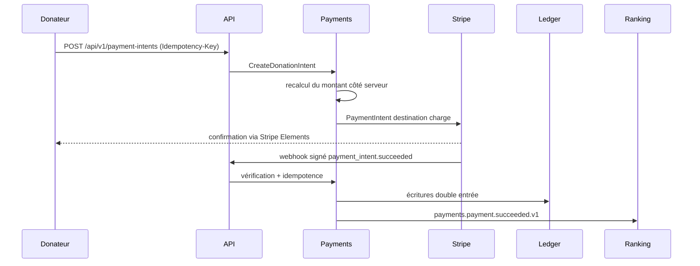

# Flux métier de référence

## Contribution

La fin exige la déclaration du contributeur et la confirmation du porteur. Cette double confirmation alimente la réputation et prépare un éventuel escrow.

## Don financier

## Feed

Le module `feed` maintient une projection de lecture. Les petits comptes sont distribués à l'écriture ; les comptes populaires sont fusionnés à la lecture. Le feed de découverte interroge les scores d'impact et les intérêts de l'utilisateur.
